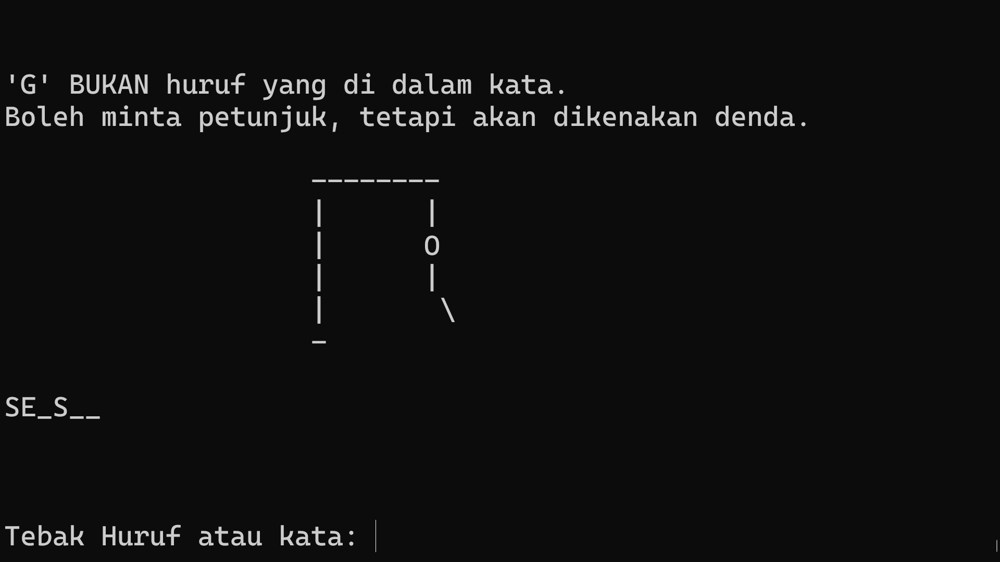

# Make my own Hangman

Forker's notes:
I removed assigning players to spevific words as it's not needed and translated the text to indonesian

TL;DR: Play hangman from command line interface. But unlike normal hangman where you guess a single generic word ('doorbell'), you are able to:
- create custom answers and hints
- create custom messaging

Steps to make this work:
- Get these files onto your computer (clone/fork the repo, copy/paste the code, anything to get it onto your machine)
- Replace players/answers/themes/hints in `custom_words.py` with players/answers/themes/hints relevant for your people
- Navigate to the folder with these files via command line (for Mac users, open Terminal and cd into the folder that contains these files)
- Type the following, then play the game from command line: `python hangman.py`
